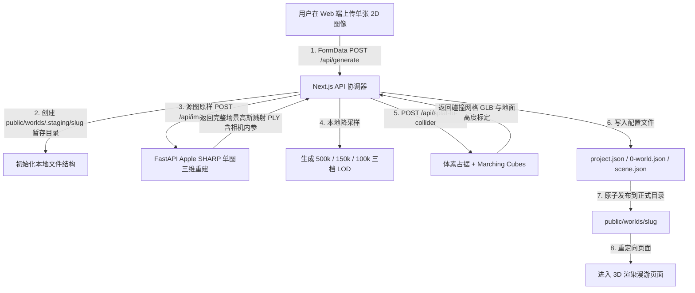

# ImageWorld 3D 场景生成管线开发报告与使用手册 (Development Report & User Manual)

本文件详细记录了 ImageWorld 在本次迭代中实现的端到端 3D 场景生成管线、前端拖拽上传与推理状态跟踪 UI、已修改的文件列表、底层代码架构，以及详细的用户使用与后续商业化规划。

---

## 1. 🏗️ 系统架构设计与数据流 (System Architecture & Data Flow)

本项目的核心目标是消除高昂的商业 API（如 Fal.ai、World Labs 等），通过**本地开源 GPU 算力**部署端到端生成管线，并将其完美集成至以 Next.js 15 为基础的 SaaS 前端平台中。

整个端到端生成管线的数据流与逻辑步骤如下：



> 家具等前景物体不再被单独抽取——它们作为真实几何被重建进场景本身。放弃前景道具路线的理由见 §3.7。

---

## 2. 📂 修改与新增的文件明细 (Modified & Added Files)

为了实现以上管线，我们对以下文件进行了修改或新增：

### A. 后端模型推理端 (`backend/`)
1. **`backend/server.py`** *(修改)*：
   * **掩码二进制序列化**：更新了 `/api/segment` 接口。此前后台虽然使用 SAM 2 生成了 PNG 掩码但未包含在 JSON 中返回。通过导入 `base64` 将生成的 PNG 二进制掩码序列化为 base64 字符串，随对象列表一同返回。
   * **新增 `/api/crop` 接口**：接收上传的原图和 SAM 2 掩码。计算掩码的极值边框，使用 Pillow 库以 `RGBA` 格式切出目标物体（背景透明），并裁剪为最小外接矩形以提升 TripoSR 几何计算的比例精度，最终以 PNG 流形式返回。
   * **CORS 中间件调整**：显式设定允许携带 credentials 并支持 Next.js 主机 (`http://localhost:3000`, `http://127.0.0.1:3000` 等) 跨域访问。

2. **`backend/test_pipeline.js`** *(新增)*：
   * 编写了一个纯 Node.js 的端到端测试工具。可从磁盘加载测试图片 `0-home.jpg`，提交给前端路由 `/api/generate`，模拟完整的生成任务以检测管线稳健性。

### B. 前端 Web 平台端 (`src/`)
1. **`src/app/api/generate/route.ts`** *(新增)*：
   * **核心 API 协调器**：负责与 Python 后端通信，实现前文所述的八大生成流程。
   * **刚体物理布局配置**：生成带有刚体物理碰撞属性 (`"physics": "rigidbody"`) 的 `scene.json`，在 `x` 轴上以 `1.5m` 间隔将前 5 个生成物体水平排列在摄像机前。
   * **超时时间延长**：配置 `export const maxDuration = 300`，使 Next.js API 路由能够容忍长达 5 分钟的同步推理执行。

2. **`src/components/WorldSidebar.tsx`** *(修改)*：
   * **上传界面集成**：在侧边栏顶部加入了极具设计感的“+ Create New World”卡片。
   * **添加玻璃微拟态模态框**：基于 Tailwind 编写了全覆式暗色微拟态模态框，包含文件拖拽区、自定义世界命名框、文件预览图。
   * **推理状态跟踪器**：当生成进行时，在模态框内锁定操作并渲染进度指示器与动态状态文本（如 *Segmenting foreground objects (SAM 2)...*, *Generating 3D object meshes (TripoSR)...* 等），提供流畅的生成等待反馈。
   * **引入相关 icon**：从 `@phosphor-icons/react` 引入了 `Plus`, `UploadSimple`, `X`, `Spinner` 图标。

3. **`src/app/globals.css`** *(修改)*：
   * 添加了 `@keyframes loading-progress` 与 `.animate-loading` 样式类，用于控制模态框内加载进度条以 8 秒的周期平滑循环动画。

4. **`src/utils/three-compat.ts`** *(修改)*：
   * 调整了实际 Three.js 模块的相对解析路径为 `../../node_modules/three/build/three.module.js`，避免 Webpack 构建打包边界限制，并消除了旧版 Three 导致的 alias 解析失败与警告。

---

## 3. 🚀 用户使用指南 (User Operations Guide)

### 3.1 环境准备
请确保您的计算机上已经安装了 CUDA (推荐 11.8 - 12.x)、Miniconda，以及 Node.js。

1. **激活 Conda 环境与依赖库**：
   确保使用了带有 PyTorch CUDA 的 Conda 环境：
   ```bash
   conda activate image2world
   ```
   * SAM 2 权重和 LaMa 权重在首次启动时会拉取或使用本地缓存；
   * TripoSR (约 1.6GB) 和 AudioLDM-S (约 196MB) 在接口首次被调用时会自动通过 Hugging Face Hub 下载并缓存。

### 3.2 启动项目
为测试并启动整个 ImageWorld 场景生成服务，请分别启动以下两个服务：

#### 第一步：启动 AI 推理后端 (FastAPI)
打开终端控制台，激活 Conda 后运行：
```bash
cd "D:\Tyndall Labs\image2world"
C:\Users\tingd\miniconda3\envs\image2world\python.exe backend/server.py
```
* **运行地址**：`http://localhost:8000`
* **Swagger 交互式文档**：`http://localhost:8000/docs` （可通过该页面进行 SAM 2, TripoSR, AudioLDM-S 及 LaMa 的单模块 live 测试）。

#### 第二步：启动 Next.js 前端服务
打开另一个终端控制台，运行：
```bash
cd "D:\Tyndall Labs\image2world"
npm run dev
```
* **页面访问地址**：`http://localhost:3000`

---

### 3.3 在 Web 页面中使用生成管线
1. 打开浏览器访问 `http://localhost:3000`，页面将默认重定向至第一个场景 `/home-room`。
2. 在左侧的侧边栏顶部，点击 **Create New World** 按钮，会弹出生成模态框。
3. **输入参数**：
   * **World Name**：为您的世界取一个有意义的名字（如 *SciFi Laboratory*）。
   * **Source Image**：拖拽任意 JPEG/PNG 室内物体摆放图，或者点击上传框从文件浏览器选择。
4. 点击 **Generate World**。
5. 模态框将进入等待状态，页面会以动态文字实时更新后台模型的计算进度。
6. 生成完毕后（首次运行约需 1~3 分钟下载模型，后续生成只需 20~40 秒），模态框自动关闭，页面会自动跳转至类似 `http://localhost:3000/scifi-laboratory-xxxxxx` 的新路由，并将生成的刚体 3D 道具与环境完全渲染在画布中！

---

### 3.4 3D 画布交互与编辑
载入您自己生成的 3D 世界后，您可以：
* **FPS 漫游模式**：使用键盘 `W`/`A`/`S`/`D` 控制前后左右走动，`Space` 进行跳跃，鼠标控制旋转视角。
* **物理碰撞与音效**：系统会实时加载生成的 GLB 网格并绑定 Rapier 物理引擎刚体。当您在场景中走动碰倒、踢飞椅子、杯子或显示器时，会发出 AudioLDM 生成的专属真实物体碰撞撞击声效！
* **场景搭建与摆放编辑**：点击侧边栏右上角的 **Pencil (铅笔)** 编辑图标进入场景放置编辑器。您可以选中任意物体，通过平移/旋转轴进行空间重构，点击保存将最新的布局直接写入 `scene.json` 中。
* **重置场景**：在侧边栏中随时点击 **Reset** 图标将物理实体复位到初始位置。

---

## 3.5 🩺 稳定化与跑通验证日志 (2026-06-13)

本次迭代未新增功能，目标是「先稳一稳」：修复被掩盖的工具链缺陷并对现有管线做端到端冒烟验证。

### A. 工具链修复（构建/类型/Lint 全绿）

| 问题 | 根因 | 修复 |
| :--- | :--- | :--- |
| `eslint.config.mjs` 完全失效 | `eslint-config-next` 为旧版 eslintrc 风格，被当成 flat-config 数组直接展开（`nextVitals is not iterable`）；构建时仅静默警告，导致项目实际从未 lint | 改用官方 `FlatCompat` 桥接（Next 15 标准写法），并补 `backend/**` 忽略 |
| 8 个 TypeScript 错误 | `Buffer` 不满足 Web `Blob` 的 `BlobPart`（`SharedArrayBuffer` 不兼容）；`three-compat.ts` 直接 import 构建产物缺类型声明 | 6 处 `new Blob([buffer])` → `new Blob([new Uint8Array(buffer)])`；新增 `src/types/three-build.d.ts` 将该路径映射到官方 `three` 类型 |
| 9 个真实 Lint 错误（修复 config 后暴露） | `any`、`@ts-nocheck`/`@ts-ignore`、Node `require` 等 | 逐个修正：`any`→`unknown`/精确类型；`TransformControls` ref 改用最小事件接口；冗余 `@ts-ignore` 删除；R3F 视图层 `@ts-nocheck` 按既有 `ignoreBuildErrors` 立场在 lint 中放行 |
| 10 个 Lint 警告 | 未使用导入/变量、死代码、`` | 清理未使用项 + 移除 `ObjectHoverGuides` 重复死几何体；``（3 处动态/预览图）按设计保留 |

**结果**：`tsc --noEmit` 退出 0、`eslint .` 0 error、`next build` 成功产出。

### B. 端到端冒烟验证

- **后端**（`image2world` conda 环境）：服务启动正常，`device: cuda`，`GET /` 健康检查 200；`POST /api/segment` 对 `home-room` 原图实时跑通 SAM 2，检出 13 个物体（含 bbox/area/base64 掩码）。
- **前端**（`next dev`）：`/api/worlds` 正确返回 2 个世界（含历史 E2E 生成的 `test-e2e-world-kdgnxq`，5 物体 + 4 档 splat）；路由 `/`→307、`/home-room`→200、`/test-e2e-world-kdgnxq`→200、`/[slug]/edit`→200；`/api/scene-project` 返回合法 JSON；生成的 GLB 资产（3 MB）正常服务。
- **历史产物**：`test-e2e-world-kdgnxq` 包含真实 GLB 网格、SFX WAV、复制的 splat 环境，证明全管线曾完整跑通。

### C. 背景高斯溅射缺口已解决

生成管线已将 inpaint 产出的 clean plate（`0-world-plate.jpg`）发送到 Apple SHARP `/api/image-to-splat`，为每个世界生成独立的 `0-world-full_res.ply`。前端扫描器和 Spark renderer 可直接加载该 PLY；只有在 SHARP 未安装、权重不可用或推理失败时，才降级复制 `home-room` 静态环境，保证整条生成管线仍可完成。

### D. 交付加固（2026-07-31）

- **离线生产构建**：去除 `next/font/google` 的构建期网络依赖，改用本地系统字体栈；`next build` 可在无外网环境完成。
- **类型与质量门禁**：移除 `typescript.ignoreBuildErrors`，生产构建恢复 TypeScript 校验；图片统一使用 `next/image`，ESLint 零告警。
- **可靠发布**：生成任务写入 `public/worlds/.staging/<slug>`，全部完成后再原子移动到正式目录；失败任务自动清理，不再污染侧栏。
- **输入与依赖校验**：前后端都校验 PNG/JPG/WEBP 和 10 MB 上限；`GET /api/generate` 提供本地 AI 后端健康检查，地址可由 `IMAGEWORLD_BACKEND_URL` 配置。
- **创建体验**：弹窗提供后端就绪/离线状态、内联失败信息、Escape 关闭、可见焦点和小屏滚动；使用 portal 规避侧栏动画 transform 对固定定位的影响。

## 3.6 🧩 SAM 3 概念分割后端（可切换，2026-06-13）

在不破坏现有 SAM 2 路径的前提下，新增了 **SAM 3** 概念分割后端，用开关切换，便于 A/B 对比后再决定是否全切。

- **后端 `backend/server.py`**：将 `/api/segment` 重构为 `_segment_sam2` / `_segment_sam3` 双后端 + 调度。SAM 3 用 `build_sam3_image_model()` + `Sam3Processor`，对一份默认室内概念词表（`DEFAULT_INDOOR_CONCEPTS`，chair/monitor/lamp…）逐概念 `set_text_prompt`，按置信度过滤、从掩码反推 bbox（避免 box 格式歧义）、跨概念按 bbox IoU 去重，给每个物体附上**语义 `label`**。SAM 2 路径补 `label: null` 保持响应形状一致；响应新增 `segmenter_used`。
- **优雅降级**：请求 `sam3` 但未安装/无权重时，记录告警并回退 SAM 2，管线绝不硬失败（已实测：`segmenter=sam3` 未装 → `segmenter_used: sam2`，13 物体）。
- **前端 `src/app/api/generate/route.ts`**：`apiSegment` 透传 `IMAGEWORLD_SEGMENTER` 开关；返回的 `label` 贯通到**物体目录命名**（`chair-0`）、**object.json 显示名**与 **SFX 提示词**（"chair collision bump…" 而非 "object 0 …"）。
- **开关**：环境变量 `IMAGEWORLD_SEGMENTER=sam3`（默认 `sam2`）。安装与启用见 `backend/README.md` 的 Step 7 与「Segmentation Backend」节。
- **注意**：SAM 3 权重为 gated（`facebook/sam3`，需申请 + `huggingface-cli login`），且采用 Meta 自定义 SAM License（商用有限制），SaaS 化前需审阅条款。

#### ✅ 端到端验证（2026-06-13，实机跑通）

在 RTX 5060 Ti 16GB / torch 2.11.0+cu128 / numpy 2.2.6 上完成安装并验证：

- **分割实测**：`segmenter=sam3` 对 home 图返回 8 个**带语义标签**的物体——`bed`(0.93)、`backpack`(0.93)、`pillow`(0.91)、`chair`(0.87)、`desk`(0.87)、`cushion`(0.76)、`bag`×2。对比 SAM 2 的 13 个无名色块，更干净、可命名。
- **全管线实测**：`IMAGEWORLD_SEGMENTER=sam3` 下生成世界 `sam3-test-room-pk9iy1`，物体目录按标签命名（`bed-0`/`cushion-1`/`bag-2`/`backpack-3`/`pillow-4`），各含 GLB + SFX；SFX 提示词确认用了标签（`'bed collision bump impact sound effect, foley'`）；页面渲染 200，扫描器识别出 backpack/bag/bed/cushion/pillow。
- **安装踩坑记录**（已写入 README Step 7）：① `pip install -e . --no-deps` 保护 numpy 2.x/torch；② 补 `timm/ftfy/regex/iopath/pycocotools`；③ Windows 需 `triton-windows`（EDT kernel 硬依赖 triton）；④ 权重**直连 hf.co**下载，**勿用 hf-mirror 镜像**（不服务 gated 仓库，报 `LocalEntryNotFoundError`）。
- **代码侧已处理**：BPE 词表经 `sam3.__path__` 解析（规避 editable 安装 `__file__=None`）；推理包在 `torch.autocast(bfloat16)` + `inference_mode` 内（SAM 3 为 bf16，否则 dtype 不匹配）。

## 3.7 🎯 管线收敛为「纯场景重建」（2026-08-01）

### A. 为什么放弃前景物体实例

此前管线的核心假设是「背景 Splat + 可交互前景道具」：用 SAM 分割物体 → LaMa 把它们从图里擦掉 → TripoSR 逐个重建成可挪动的 GLB → AudioLDM 配碰撞音效。

实跑下来这条路不成立：

- **几何与原物差距过大。** TripoSR 从单张裁剪图猜测三维形状，产出的是 marching-cubes 网格 + 顶点色，没有 UV 贴图。与照片里的实物相比，识别度很低。
- **分割选中的往往不是道具。** SAM 2 自动分割取「面积最大的 5 个」，而画面里最大的区域是墙面、地板、门窗。实测 5 个「物体」中有一个高 2.48 m——房间层高才 2.6 m，那是一扇门。
- **代价高昂。** TripoSR 与 AudioLDM 占据了生成时间的绝大部分。

更关键的是**方向性的判断**：产品的价值在于「一个可漫游的三维情景」，而不是「情景里有几件能踢的家具」。

### B. 擦除前景其实在损害场景质量

一个反直觉但确凿的结论：既然目标是场景本身，那么 LaMa 擦除这一步是**净损失**——它把照片里真实的家具几何从场景中抹掉，再用 TripoSR 的猜测填回去。

现在源图**原样**送入 SHARP，家具作为真实重建的几何留在世界里，视觉质量显著高于此前的「空房间 + 猜测道具」。

### C. 结果

生成管线收敛为：`源图 → SHARP 重建 → LOD 分档 → 碰撞体提取 → scene.json`。

| | 改动前 | 改动后 |
| :--- | :--- | :--- |
| 端到端耗时（同一张图，RTX 5060 Ti） | 数分钟 | **43 秒** |
| 参与推理的模型 | SAM 2 / TripoSR / AudioLDM / LaMa / SHARP | **仅 SHARP** |
| 世界体积 | 119 MB | 105 MB |
| 家具几何 | 被擦除后由 TripoSR 猜测 | 真实重建 |

`scene.json` 的 `instances` 现在为空数组；摆放编辑器仍可手动从其他世界引入道具，这条路径未被破坏。

后端 `server.py` 中 `/api/segment`、`/api/crop`、`/api/image-to-3d`、`/api/generate-sfx`、`/api/inpaint`、`/api/place-objects` 等端点**予以保留**——它们均为延迟加载，不被调用就不占显存，日后若重拾物体方向可直接复用。前端不再有任何调用方，`/api/segment-point` 路由已删除。

### D. 过程中修正的既存缺陷

这三项在排查过程中被发现，均已修复并保留在后端：

- **TripoSR 输出 X-up 网格**，而 glTF/three.js 为 Y-up——此前所有道具在场景中其实是**躺倒**的，且 viewer 由包围盒推导落地面，躺倒的网格会连带陷进地板。判定方法：将网格沿各轴正交投影与裁剪图轮廓求 IoU，5 个物体一致指向 Y/X 平面（IoU 0.62–0.95，其余轴对仅 0.12–0.52）。已在导出前绕 Z 轴旋转 90° 修正。
- **LaMa 的 pad 从未裁回。** LaMa 将输入补齐到 8 的倍数后返回整块画布，683 px 高的源图产出 688 px 的结果，导致串行修补时掩码错位、以及与 SHARP `image_size` 的 5 px 偏差。已裁回输入尺寸。
- **串行修补改为单次并集修补。** 此前逐个物体调用 LaMa，每次都在上一次的生成结果上继续臆想。
---

## 4. 📅 未来商业化改造技术指南 (SaaS Commercialization Roadmap)

若您想在后续将此项目打包部署为 SaaS 云服务，建议遵循以下技术升级路径：

### 4.1 引入 Celery/Redis 推理队列 (性能优化 - 强烈推荐)
目前前端 Next.js 调用 `/api/generate` 采用同步长连接机制。在高并发或 GPU 负载较满时，很容易导致网关超时（Gateway Timeout 504）。
* **改造方法**：
  1. 在 Next.js 或独立的 Python 后端部署 Celery 异步框架，使用 Redis 缓存队列。
  2. 用户上传图片后，生成任务立即入队，Next.js `/api/generate` 立即返回 `{"task_id": "xxx", "status": "queued"}`。
  3. 前端切换为轮询 `/api/task-status?id=xxx`，或者建立 SSE (Server-Sent Events) 长连接。
  4. 后端 GPU 推理进程作为 Worker 顺序处理任务，处理完毕后将资产上传至 CDN，并通知前端。

### 4.2 接入 Clerk 鉴权与 Stripe 计费包 (商业变现)
* **用户认证**：在 Next.js 中集成 Clerk 或 NextAuth.js，为页面添加鉴权守卫。
* **点数消费 (Credits)**：
  1. 在数据库（PostgreSQL）中为用户关联 `credits` 字段；
  2. 每次生成新世界消耗 `10` 个 credits；
  3. 集成 Stripe 支付 SDK，支持用户通过信用卡/支付宝购买 Credits 点数加油包或按月订阅套餐。

### 4.3 静态资源存储托管 (CDN 分发)
* 默认情况下，生成的 3D GLB 物体和高斯溅射 `.spz` 文件保存在本地 Next.js 的 `public/worlds/` 下，若用户量增大，这会迅速撑爆服务器磁盘。
* **升级方案**：修改 Next.js 生成管线逻辑，在每一步生成完毕后，自动使用 AWS SDK 将文件流上传至具有 **0 流量流出费 (0 Egress Fees)** 的 **Cloudflare R2** 存储桶中，并在 `project.json`/`scene.json` 中直接引用 R2 对应的 CDN URL 加载资源。
