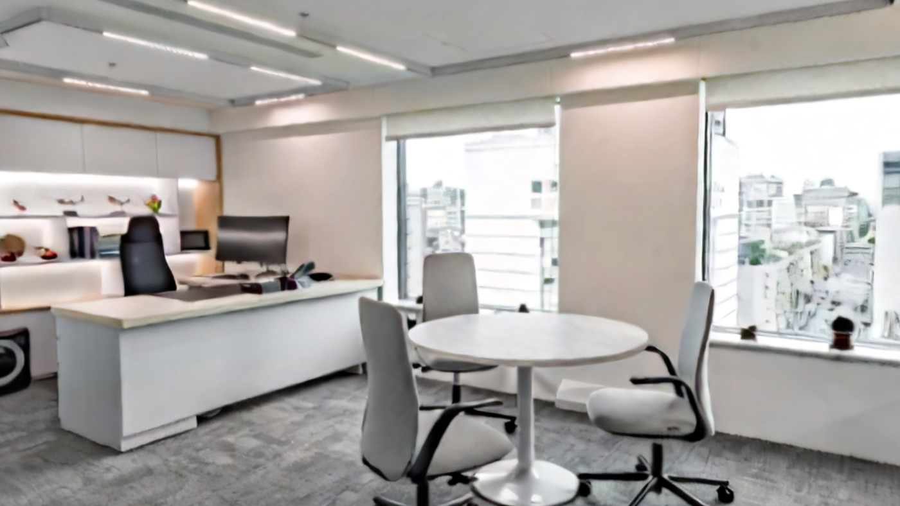
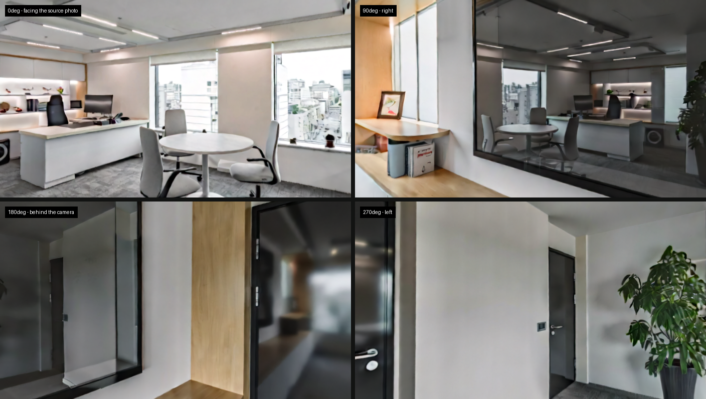
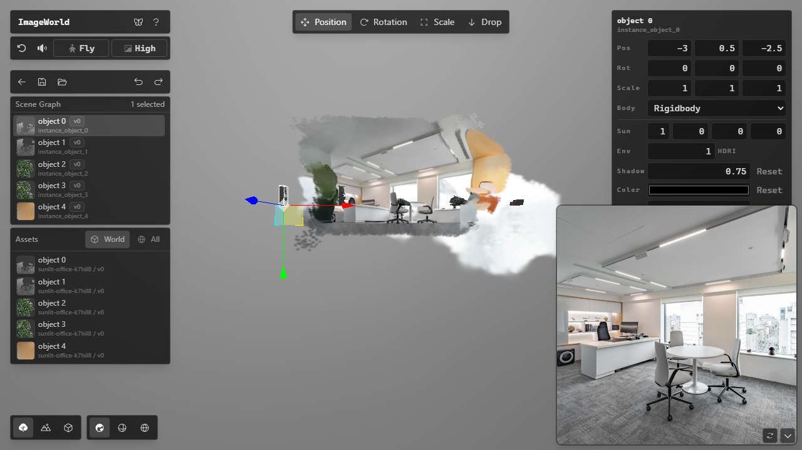
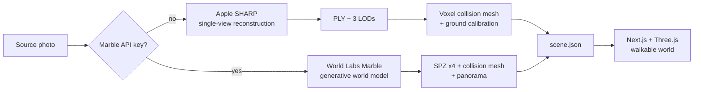

<div align="center">

# Image2World

### One image in. A navigable 3D world out.

Build a local, interactive 3D scene from a single image — with a Gaussian-splat
environment, editable 3D objects, physics, and generated spatial audio.

[中文使用指南](./USAGE.md) · [AI backend setup](./backend/README.md) · [USD export](./scripts/usd-export/README.md)


</div>



<div align="center">

**The world is closed on every side.** Turning around inside it shows a corridor
and a glass partition that the source photo never captured — a generative world
model fills in what the camera could not see, so you can walk anywhere instead
of falling out the back.

</div>



Image2World turns a single photo into a space you can walk through — a Gaussian
splat you can see, a collision mesh you can bump into, and a scene descriptor you
can edit. Generated assets are ordinary local files (PLY/SPZ, GLB, audio, JSON),
not records locked behind a hosted API.

The product is **the space itself**, not props inside it. An earlier version
rebuilt each piece of furniture as a separate physics object; that was removed
once it became clear the room mattered more than the chairs in it (see
[the implementation notes](./docs/IMPLEMENTATION.md#71-放弃前景物体实例)).

## Why Image2World

- **A scene, not a depth effect.** The photo becomes a 3D Gaussian splat with
  four LODs, and the splat cloud is turned into a collision mesh, so the world is
  solid rather than merely visible.
- **Two pipelines, one interface.** Run locally on your own GPU in seconds, or
  hand it a World Labs Marble key and get a fully enclosed world you can turn
  around inside. Same upload dialog, same output format.
- **Bring your own key.** Cloud generation bills to your account, not to this
  project. The key lives in your browser, is sent per request, and is never
  written to disk or logged server-side.
- **A world you can edit.** Placement, rotation, scale, rigid/static/ghost
  bodies, lighting, ground, and shadow controls, saved to `scene.json`.
- **Local ownership.** Assets live under `public/worlds/`; the source photo stays
  docked in the viewer so the reconstruction can be compared against its input.
- **Exportable.** OpenUSD bundles for simulation (Isaac Sim / Omniverse).

## The scene editor



Every object is a real entity: select it to move, rotate, or scale it, switch
it between rigid, static, and ghost bodies, or adjust the sun and shadows. Edits
are saved to `scene.json` beside the assets.

The repository ships one sample world, **`demo-office`**, so a fresh clone has
somewhere to walk around before you set up a GPU or buy any credits. It is the
Marble world shown above, trimmed to its 100k and 500k detail levels; worlds you
generate yourself stay local and out of git.

## How it works

The upload dialog picks a backend from one thing: whether you supplied a Marble
API key.



|  | Local (SHARP) | Cloud (Marble) |
| --- | --- | --- |
| Time | **16–43 s** | ~8 min |
| Cost | free | ~$1.20, billed to your key |
| Needs a GPU | yes | **no** |
| Behind the camera | nothing — you walk out into empty space | **complete** |
| Away from the capture pose | streaks and smearing | **stays sharp** |

The difference is not quality tuning, it is what the two things *are*. SHARP
reconstructs surfaces the camera saw. Marble is a generative world model: it
invents the rest of the room. Scanning 24 compass directions at body height from
the spawn point, a SHARP world leaves **8 of them with no geometry at all** —
all behind the camera, because a photo cannot see the photographer's back. The
same measurement on a Marble world returns **zero**.

Start local, and add a key when you want a world that closes behind you.

## Quick start

Image2World has two local processes: the browser app and the AI inference
backend. **If you only intend to generate through Marble, you can skip the
backend entirely** — cloud generation needs no local GPU.

### Prerequisites

- Node.js with npm
- Python 3.10
- An NVIDIA CUDA GPU is strongly recommended for the full generation pipeline
- Model weights require several gigabytes of disk space and are downloaded on
  first setup or first use

The current backend configuration has been exercised on a 16 GB NVIDIA GPU.
Other GPUs may work, but inference time and memory pressure vary by model.

### 1. Install the AI backend (local pipeline only)

Complete the one-time model installation in
[`backend/README.md`](./backend/README.md). Generation itself only needs
**SHARP**; the other models are kept for the object endpoints, which are no
longer part of the pipeline and load lazily, so an uncalled one costs no VRAM.

> Do not skip the SHARP step — without it local generation fails outright.

After setup, start the service:

```bash
conda activate image2world
python backend/server.py
```

The API is available at `http://localhost:8000`; interactive OpenAPI
documentation is served at `http://localhost:8000/docs`.

### 2. Start the web app

In a second terminal:

```bash
npm install
npm run dev
```

Open [http://localhost:3000](http://localhost:3000). A fresh clone opens
`demo-office`, the bundled sample world — walk around it with `W` `A` `S` `D`
before installing anything. Worlds you generate appear alongside it.

Those stay out of git: they run to hundreds of megabytes each and reconstruct
the room in whatever photo you upload.

### 3. Generate a world

1. Select **Create New World**.
2. Name the world and upload an indoor image.
3. Optionally paste a **Marble API key** ([get one
   here](https://platform.worldlabs.ai/api-keys)) to generate a fully enclosed
   world in the cloud. Leave it empty to use your local GPU.
4. Select **Generate World** and follow the streamed stage-by-stage progress.
5. Explore the result, or use the pencil button to open the scene editor.

The first local run is slower because model weights are loaded or downloaded
lazily. The key is remembered in your browser for next time.

> Marble's API has **no free tier** — the free generations on
> marble.worldlabs.ai belong to the web app and are a separate wallet. A world
> costs about 1500 credits (~$1.20), plus 80 for the image upload.

## Controls

| Action | Control |
| --- | --- |
| Move | `W` `A` `S` `D` |
| Look | Mouse |
| Jump | `Space` |
| Hide the interface | `` ` `` |
| Switch navigation | **FPS** / **Fly** button — FPS is the default and the one with gravity, collisions, and jumping; Fly moves the camera directly for inspection |
| Change splat detail | **Low** / **High** quality button |
| Edit a world | Pencil button beside the world |
| Reset scene objects | Reset button |
| Toggle sound | Speaker button |

## Generated project format

Every world is self-contained:

```text
public/worlds/<slug>/
├── project.json                 # Project identity, display name, generator
├── scene.json                   # Placements, physics, lighting, ground calibration
├── source/
│   └── 0-source.png             # Original input
└── output/
    ├── world/
    │   ├── 0-world.json         # Asset manifest + coordinate metadata
    │   ├── 0-world-full_res.spz # Gaussian splat (.ply from SHARP, .spz from Marble)
    │   ├── 0-world-500k.spz     # Viewer LODs
    │   ├── 0-world-150k.spz
    │   ├── 0-world-100k.spz
    │   ├── 0-world.glb          # Collision mesh
    │   └── 0-world-pano.png     # 360 panorama (Marble only)
    └── sfx/                     # World ambience
```

Both pipelines write the same layout, so a world is interchangeable regardless of
how it was made. The scanner discovers versions and assets from disk by the
`<index>-<name>.<ext>` convention — **a file that does not follow it is silently
ignored**, which is the first thing to check when an asset is on disk but will
not load. Failed jobs stay hidden in a staging directory and are cleaned up
rather than appearing as half-built worlds.

`0-world.json` and `scene.json` both carry `metric_scale_factor`, `flip_y`, and
`ground_plane_offset`; `scene.json` wins. Getting these wrong yields a room of
the wrong size or upside down — Marble's scale factor is emphatically not 1. The
transform chain is written out in
[the implementation notes](./docs/IMPLEMENTATION.md).

## Architecture

| Layer | Technology | Responsibility |
| --- | --- | --- |
| Web app | Next.js 15, React 19, TypeScript | Routing, upload workflow, streamed generation state |
| 3D runtime | React Three Fiber, Three.js, Spark | Gaussian splats, GLB assets, cameras, rendering |
| Physics | `@react-three/rapier` | Colliders and rigid/static/ghost object bodies |
| State and UI | Zustand, Radix Themes, Tailwind CSS | Viewer state, controls, editor interface |
| AI service | FastAPI, PyTorch | Local model lifecycle and inference endpoints |
| Local reconstruction | Apple SHARP | Single-image Gaussian splat |
| Cloud reconstruction | World Labs Marble | Generative world model, via the user's own key |
| Collision | scikit-image, trimesh | Voxel collision mesh and ground calibration from the splat cloud |

The browser-facing generation route coordinates the whole pipeline, streams
newline-delimited progress events, propagates cancellation, applies per-stage
timeouts, and publishes the project only after generation succeeds.

Backend endpoints for the retired object pipeline (`/api/segment`, `/api/crop`,
`/api/image-to-3d`, `/api/generate-sfx`, `/api/inpaint`) still exist and still
work — they are lazily loaded, so keeping them costs nothing until called.

Heavy endpoints run through a semaphore on a worker thread, so inference neither
blocks the event loop nor lets two jobs contend for VRAM: concurrent requests
queue instead.

## Configuration

| Variable | Default | Purpose |
| --- | --- | --- |
| `IMAGEWORLD_BACKEND_URL` | `http://localhost:8000` | Address of the local FastAPI service |
| `NEXT_PUBLIC_IMAGEWORLD_LOCAL_TOOLS` | unset | Re-enables "open world folder" / "open terminal" in a production build |
| `IMAGEWORLD_SEGMENTER` | `sam2` | Segmentation backend for the retired object endpoints; `sam3` adds semantic labels |

```powershell
$env:IMAGEWORLD_BACKEND_URL = "http://localhost:8000"
npm run dev
```

The Marble API key is **not** an environment variable — it is entered in the
create dialog and kept in your browser's local storage, so a deployed instance
never holds anyone's credentials.

> The local-tool routes spawn a file manager or a terminal **on whichever
> machine runs the server**. They 404 in production for that reason. Only set
> `NEXT_PUBLIC_IMAGEWORLD_LOCAL_TOOLS=true` when the server is your own machine.

The variable names keep the older `IMAGEWORLD_` spelling deliberately; renaming
them would break existing configurations. Same for the browser storage keys.

## Development

Run the complete frontend quality gate:

```bash
npm run check
```

This executes ESLint, TypeScript type checking, the unit tests, and a production
Next.js build. Run it with the dev server stopped — `next build` and `next dev`
share `.next` and will clobber each other, and the symptom is a runtime
`Cannot find module './vendor-chunks/....js'` that looks like a code bug but is
not. To check types while the dev server runs, use `npm run lint && npx tsc
--noEmit`.

Tests alone (Node's built-in runner, no extra dependencies):

```bash
npm test
```

The USD exporter has its own suite, which also guards the transform semantics it
duplicates from the TypeScript runtime:

```bash
npm run test:usd
```

Regenerate PLY LODs after replacing a full-resolution splat:

```bash
npm run assets:lod
```

Rebuild the background collision proxy and ground calibration for a world.
Generation does this automatically; the script is for re-running it with
different settings:

```bash
conda activate image2world
python backend/tools/build_collider.py <world-slug>
```

It writes `<n>-world.glb` and calibrates `ground_plane_offset` so the floor
lands on y=0. The proxy covers what the source photo could see — the visible
floor, camera-facing walls, and the fronts of objects. It is not a sealed room:
single-view reconstruction has no data behind the camera or behind an occluder,
so the walkable area ends where visibility ends.

Export a world to an OpenUSD bundle for simulation use — the splat becomes a
`ParticleField3DGaussianSplat` prim and objects keep their placements, rigid
bodies, and colliders:

```bash
npm run export:usd -- <world-slug>
```

The background collision mesh, objects, lights, and physics load anywhere.
Rendering the splat additionally needs an OpenUSD 26.03+ runtime that implements
the schema — Isaac Sim 5.1 ships 24.05 and cannot, so pass `--no-splat` for
simulation targets. This also needs a one-time Python environment — see
[`scripts/usd-export/README.md`](./scripts/usd-export/README.md).

Useful entry points:

| Path | Purpose |
| --- | --- |
| `src/app/api/generate/route.ts` | End-to-end generation coordinator |
| `src/components/WorldViewer.tsx` | Interactive world runtime |
| `src/modules/scene/PlacementEditor.tsx` | Scene graph and placement editor |
| `src/utils/worldsScanner.ts` | Local project and asset discovery |
| `backend/server.py` | FastAPI model endpoints |
| `scripts/usd-export/export_world_usd.py` | OpenUSD bundle export |

## Current limitations

Everything below applies to the **local** pipeline. Marble worlds are closed on
every side and stay sharp as you move, which is what you pay for.

- SHARP performs **single-view reconstruction**, not 360° capture. Measured on a
  real room, 8 of 24 directions at body height had no geometry at all, all of
  them behind the camera.
- The collision mesh is therefore not a sealed room: walk past the edge of what
  the photo could see and you pass through. The flat ground plane is what keeps
  you from falling, so you end up standing in empty space rather than plummeting.
- Leaving the capture pose smears occluded regions into streaks. This is
  inherent, not a tuning problem — single-view gives each pixel one depth, so
  objects on a desk become flat patches with no sides. Filtering the point cloud
  was tried and measured, and does not help; it only leaves holes.
- Local generation is GPU-intensive, and first use downloads several GB.
- Some upstream models have licenses or access conditions that differ from this
  repository's source license.

These constraints are documented deliberately: reproducible expectations make
the project more useful than a polished demo that hides its boundaries.

## Roadmap

- SPZ output for the local pipeline. Marble already returns SPZ, roughly a
  quarter the bytes per splat of the PLY that SHARP produces
- A self-hosted world model as an alternative to a paid API. Matrix-3D is the
  leading candidate — MIT licensed and it fits in 12 GB — though renting a cloud
  GPU to run it is not obviously cheaper than Marble's $1.20 per world
- Resumable generation jobs and persistent inference queues
- Portable world bundles for sharing. OpenUSD export (`npm run export:usd`)
  covers the simulation path (Isaac Sim / Omniverse), not general sharing
- A cross-platform model setup and hardware diagnostic command
- More automated browser, pipeline, and visual regression coverage

## Contributing

Issues, experiments, and pull requests are welcome. The most useful
contributions include a reproducible input, the observed output, hardware and
model details, and before/after media when visual quality is involved.

Before submitting a change:

```bash
npm run check
```

If Image2World is useful to your research or prototyping, consider starring the
repository — it helps other builders discover the project.

## License

Image2World source code is released under the [MIT License](./LICENSE).
Downloaded or bundled model weights are governed by their respective upstream
licenses. Review the SAM, TripoSR, AudioLDM, and SHARP terms before commercial
deployment, and World Labs' terms if you generate through Marble.

## Acknowledgements

Image2World builds on SHARP from Apple Machine Learning Research and
[Marble](https://www.worldlabs.ai/) from World Labs for reconstruction, plus
Three.js, React Three Fiber, Spark, and Rapier for the runtime.

The retired object pipeline — still present as backend endpoints — uses
[SAM 2](https://github.com/facebookresearch/sam2) and
[SAM 3](https://github.com/facebookresearch/sam3) from Meta AI,
[TripoSR](https://github.com/VAST-AI-Research/TripoSR),
[LaMa](https://github.com/advimman/lama), and
[AudioLDM](https://github.com/haoheliu/AudioLDM).

USD export uses
[`usd-convert-gsplat`](https://github.com/NVIDIA-Omniverse/usd-convert-gsplat)
from NVIDIA Omniverse, licensed under Apache-2.0 and CC-BY-4.0.
