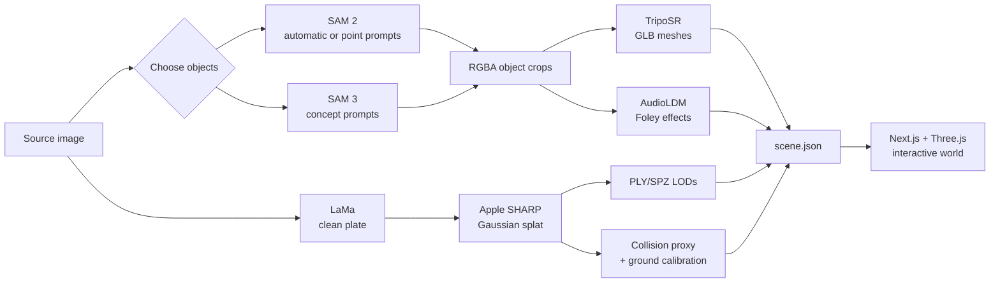

<div align="center">

# image2world

### One image in. A navigable 3D world out.

Build a local, interactive 3D scene from a single image — with a Gaussian-splat
environment, editable 3D objects, physics, and generated spatial audio.

[中文使用指南](./USAGE.md) · [AI backend setup](./backend/README.md) · [USD export](./scripts/usd-export/README.md)


</div>


image2world is an open-source, local-first pipeline that decomposes one image
into a reconstructed 3D environment and interactive foreground objects. It then
reassembles those assets in a browser-based world that you can explore, edit,
and save.

The source image stays visible in the viewer, making the reconstruction easy to
compare with its input. Generated assets are ordinary local files — PLY/SPZ,
GLB, audio, and JSON — rather than records locked behind a hosted API.

## Why image2world

- **A scene, not a depth effect.** Apple SHARP reconstructs the inpainted
  background as a 3D Gaussian splat with multiple LODs, and the splat cloud is
  turned into a collision proxy so the world is solid, not just visible.
- **Objects you can interact with.** SAM 2/SAM 3 isolates foreground objects,
  TripoSR turns them into GLB meshes, and Rapier gives them physics.
- **Sound that belongs to the object.** AudioLDM generates short Foley effects
  that play during interactions and collisions.
- **A world you can edit.** The built-in editor supports placement, rotation,
  scale, rigid/static/ghost bodies, lighting, ground, and shadow controls.
- **Local ownership.** Inference runs through a local FastAPI service and world
  assets are stored under `public/worlds/`.
- **Responsive delivery.** The viewer streams loading progress, supports
  cancellation and retry, and selects 100k/150k/500k/full-resolution splat LODs
  based on the chosen quality.

Above: a world reconstructed from one office photo. The source image stays
docked in the corner so the reconstruction can be compared against its input.

## The scene editor


Every object is a real entity: select it to move, rotate, or scale it, switch
it between rigid, static, and ghost bodies, or adjust the sun and shadows. Edits
are saved to `scene.json` beside the assets.

Worlds are local data and are not shipped with the repository — you generate
your own on first run.

## How it works



Object selection supports three workflows:

| Mode | What you do | Segmentation |
| --- | --- | --- |
| Automatic | Leave object prompts empty | SAM 2 selects the largest movable regions |
| Concept-guided | Enter labels such as `chair, monitor, lamp` | SAM 3 returns semantically named instances |
| Point-guided | Click the exact objects in the uploaded image | SAM 2 point prompts provide precise masks |

Priority is **point-guided → concept-guided → automatic** when more than one
input is present.

## Quick start

image2world has two local processes: the browser app and the AI inference
backend.

### Prerequisites

- Node.js with npm
- Python 3.10
- An NVIDIA CUDA GPU is strongly recommended for the full generation pipeline
- Model weights require several gigabytes of disk space and are downloaded on
  first setup or first use

The current backend configuration has been exercised on a 16 GB NVIDIA GPU.
Other GPUs may work, but inference time and memory pressure vary by model.

### 1. Install the AI backend

Complete the one-time model installation in
[`backend/README.md`](./backend/README.md). It covers the CUDA-enabled PyTorch
environment, SAM 2, TripoSR, **SHARP**, model weights, and optional SAM 3
support.

> Do not skip the SHARP step. Without it the pipeline still reports success but
> the background is not reconstructed at all, and the failure is easy to miss.

After setup, start the service:

```bash
conda activate image2world
python backend/server.py
```

The API is available at `http://localhost:8000`; interactive OpenAPI
documentation is served at `http://localhost:8000/docs`.

### 2. Start the web app

In a second terminal:

```bash
npm install
npm run dev
```

Open [http://localhost:3000](http://localhost:3000). On a fresh clone
`public/worlds/` is empty, so the app opens a create-world screen and reports
whether the local AI backend is ready. Once worlds exist it opens the first one.

Generated worlds are local data and are not tracked in git — they run to
hundreds of megabytes each and reconstruct the room in the source photo.

### 3. Generate a world

1. Select **Create New World**.
2. Name the world and upload an indoor image.
3. Optionally enter object concepts or click objects in the preview.
4. Select **Generate World** and follow the streamed stage-by-stage progress.
5. Explore the result, or use the pencil button to open the scene editor.

The first run is slower because model weights are loaded or downloaded lazily.
Generation time depends on the GPU, source resolution, and number of objects.

## Controls

| Action | Control |
| --- | --- |
| Move | `W` `A` `S` `D` |
| Look | Mouse |
| Jump | `Space` |
| Switch navigation | **Fly** / character controller button |
| Change splat detail | **Low** / **High** quality button |
| Edit a world | Pencil button beside the world |
| Reset scene objects | Reset button |
| Toggle sound | Speaker button |

## Generated project format

Every world is self-contained:

```text
public/worlds/<slug>/
├── project.json                 # Project identity and display name
├── scene.json                   # Placements, physics, lighting, and ground
├── source/
│   └── 0-source.png             # Original input
└── output/
    ├── world/
    │   ├── 0-world.json         # World asset manifest + ground calibration
    │   ├── 0-world-full_res.ply # SHARP Gaussian splat
    │   ├── 0-world-500k.ply     # Viewer LODs
    │   ├── 0-world-150k.ply
    │   ├── 0-world-100k.ply
    │   ├── 0-world.glb          # Background collision proxy
    │   └── 0-world-plate.jpg    # Inpainted clean plate
    ├── <object>/
    │   ├── 0-<object>.glb       # Generated interactive mesh
    │   ├── 0-<object>.png       # Segmented reference image
    │   ├── object.json
    │   └── sfx/
    └── sfx/                     # World ambience
```

SPZ backgrounds are also supported. The scanner discovers available versions
and assets from disk; failed generation jobs remain hidden in a staging
directory and are cleaned up instead of appearing as incomplete worlds.

## Architecture

| Layer | Technology | Responsibility |
| --- | --- | --- |
| Web app | Next.js 15, React 19, TypeScript | Routing, upload workflow, streamed generation state |
| 3D runtime | React Three Fiber, Three.js, Spark | Gaussian splats, GLB assets, cameras, rendering |
| Physics | `@react-three/rapier` | Colliders and rigid/static/ghost object bodies |
| State and UI | Zustand, Radix Themes, Tailwind CSS | Viewer state, controls, editor interface |
| AI service | FastAPI, PyTorch | Local model lifecycle and inference endpoints |
| Reconstruction | SHARP, LaMa | Single-image splat background and clean-plate inpainting |
| Collision | scikit-image, trimesh | Voxel collision proxy and ground calibration from the splat cloud |
| Object pipeline | SAM 2/SAM 3, TripoSR | Selection, segmentation, and image-to-3D meshes |
| Audio | AudioLDM | Object Foley effects and ambience |

The browser-facing generation route coordinates the complete pipeline, streams
newline-delimited progress events, propagates cancellation, applies per-stage
timeouts, and writes the final project only after generation succeeds.

## Configuration

| Variable | Default | Purpose |
| --- | --- | --- |
| `IMAGEWORLD_BACKEND_URL` | `http://localhost:8000` | Address of the local FastAPI service |
| `IMAGEWORLD_SEGMENTER` | `sam2` | Automatic segmentation backend; use `sam3` for semantic concepts |

PowerShell example:

```powershell
$env:IMAGEWORLD_BACKEND_URL = "http://localhost:8000"
$env:IMAGEWORLD_SEGMENTER = "sam3"
npm run dev
```

If SAM 3 is requested but unavailable, the backend records the problem and
falls back to SAM 2.

## Development

Run the complete frontend quality gate:

```bash
npm run check
```

This executes ESLint, TypeScript type checking, and a production Next.js build.
Run it with the dev server stopped — `next build` and `next dev` share `.next`
and will clobber each other.

The USD exporter has its own suite, which also guards the transform semantics it
duplicates from the TypeScript runtime:

```bash
npm run test:usd
```

Regenerate PLY LODs after replacing a full-resolution splat:

```bash
npm run assets:lod
```

Rebuild the background collision proxy and ground calibration for a world.
Generation does this automatically; the script is for re-running it with
different settings:

```bash
conda activate image2world
python backend/tools/build_collider.py <world-slug>
```

It writes `<n>-world.glb` and calibrates `ground_plane_offset` so the floor
lands on y=0. The proxy covers what the source photo could see — the visible
floor, camera-facing walls, and the fronts of objects. It is not a sealed room:
single-view reconstruction has no data behind the camera or behind an occluder,
so the walkable area ends where visibility ends.

Export a world to an OpenUSD bundle for simulation use — the splat becomes a
`ParticleField3DGaussianSplat` prim and objects keep their placements, rigid
bodies, and colliders:

```bash
npm run export:usd -- <world-slug>
```

The background collision mesh, objects, lights, and physics load anywhere.
Rendering the splat additionally needs an OpenUSD 26.03+ runtime that implements
the schema — Isaac Sim 5.1 ships 24.05 and cannot, so pass `--no-splat` for
simulation targets. This also needs a one-time Python environment — see
[`scripts/usd-export/README.md`](./scripts/usd-export/README.md).

Useful entry points:

| Path | Purpose |
| --- | --- |
| `src/app/api/generate/route.ts` | End-to-end generation coordinator |
| `src/components/WorldViewer.tsx` | Interactive world runtime |
| `src/modules/scene/PlacementEditor.tsx` | Scene graph and placement editor |
| `src/utils/worldsScanner.ts` | Local project and asset discovery |
| `backend/server.py` | FastAPI model endpoints |
| `scripts/usd-export/export_world_usd.py` | OpenUSD bundle export |

## Current limitations

- SHARP performs **single-view reconstruction**, not full 360° scene capture.
  Large camera moves behind unseen surfaces reveal missing information.
- For the same reason the collision proxy is not a sealed room. It covers the
  visible floor, camera-facing walls, and the fronts of objects; walk past the
  edge of what the photo could see and you pass through. The flat ground plane
  is what keeps you from falling.
- Local generation is GPU-intensive, and first use can involve large model
  downloads.
- TripoSR prioritizes speed over production-grade object geometry.
- Some upstream models have licenses or access conditions that differ from this
  repository's source license.

These constraints are documented deliberately: reproducible expectations make
the project more useful than a polished demo that hides its boundaries.

## Roadmap

- Higher-fidelity image-to-3D backend adapters
- Resumable generation jobs and persistent inference queues
- Portable world bundles for sharing and deployment — still open. OpenUSD export
  (`npm run export:usd`) covers the simulation path (Isaac Sim / Omniverse), not
  general sharing
- A cross-platform model setup and hardware diagnostic command
- More automated browser, pipeline, and visual regression coverage

## Contributing

Issues, experiments, and pull requests are welcome. The most useful
contributions include a reproducible input, the observed output, hardware and
model details, and before/after media when visual quality is involved.

Before submitting a change:

```bash
npm run check
```

If image2world is useful to your research or prototyping, consider starring the
repository — it helps other builders discover the project.

## License

image2world source code is released under the [MIT License](./LICENSE).
Downloaded or bundled model weights are governed by their respective upstream
licenses. Review the SAM, TripoSR, AudioLDM, and SHARP terms before commercial
deployment.

## Acknowledgements

image2world builds on
[SAM 2](https://github.com/facebookresearch/sam2) and
[SAM 3](https://github.com/facebookresearch/sam3) from Meta AI,
SHARP from Apple Machine Learning Research,
[TripoSR](https://github.com/VAST-AI-Research/TripoSR),
[LaMa](https://github.com/advimman/lama),
[AudioLDM](https://github.com/haoheliu/AudioLDM), Three.js, React Three Fiber,
Spark, and Rapier.

USD export uses
[`usd-convert-gsplat`](https://github.com/NVIDIA-Omniverse/usd-convert-gsplat)
from NVIDIA Omniverse, licensed under Apache-2.0 and CC-BY-4.0.
