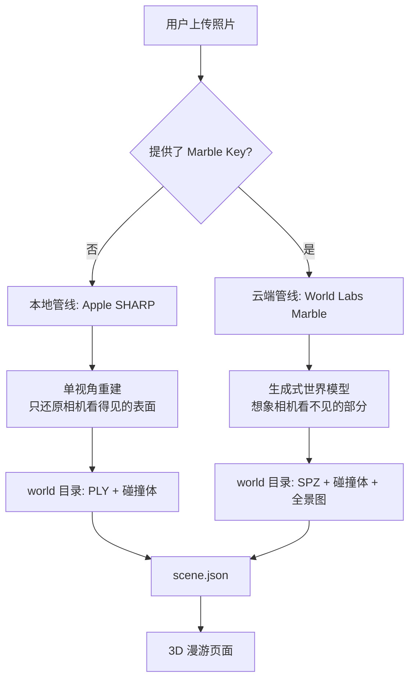

# ImageWorld 实现说明

> 本文讲解**这个项目是如何工作的**——架构、数据流、坐标系，以及那些「为什么是这样做的」。
> 按时间顺序的迭代记录见 [`PROJECT_REPORT.md`](../PROJECT_REPORT.md)，计划见 [`project_roadmap.md`](../project_roadmap.md)。

---

## 1. 一句话概括

**输入一张照片，输出一个能用 WASD 走进去、有碰撞、有物理的三维空间。**

注意重点是**空间本身**，不是空间里可以踢来踢去的家具——这个定位是经过一轮弯路才确立的，见 §7.1。

---

## 2. 系统构成

两个进程，各司其职：

| 进程 | 技术栈 | 职责 | 端口 |
| :--- | :--- | :--- | :--- |
| **前端 / 编排层** | Next.js 15 + React 19 + React Three Fiber | 上传界面、生成流程编排、3D 渲染与漫游 | 3000 |
| **推理后端** | Python + FastAPI + PyTorch | 本地 GPU 模型推理 | 8000 |

前端**同时充当编排者**：`/api/generate` 是一个流式路由，它调用推理后端（或云端 API）、把产物按约定落盘、最后写出场景描述文件。浏览器只负责渲染磁盘上已经准备好的世界。

若使用云端管线（§3.2），推理后端**完全不需要启动**——这也意味着项目可以部署在没有显卡的机器上。

---

## 3. 两条生成管线

生成时按**是否提供 Marble API Key** 自动二选一。这不是简单的 A/B，两者解决的是不同层次的问题。



### 3.1 本地管线（Apple SHARP）

```
源图 → SHARP 单视角重建 → 高斯点云 PLY
                          ↓
                   降采样出 3 档 LOD
                          ↓
              体素化 + Marching Cubes → 碰撞网格 GLB
                          ↓
                     写 scene.json
```

- **耗时**：16–43 秒（模型预热后更快）
- **产物**：`0-world-full_res.ply` 约 63 MB / 118 万高斯，外加 500k、150k、100k 三档
- **成本**：仅电费
- **本质限制**：单视角重建**只有相机看得见的表面存在几何**。实测从出生点向 24 个方向扫描身体高度，**8 个方向完全没有阻挡**，且全部集中在相机背后——因为照片拍不到拍摄者身后。

碰撞网格由后端 `/api/splat-to-collider` 从点云导出：按 0.05 m 体素统计占据、Marching Cubes 抽取表面、简化到约 6 万面，同时检测地面高度。SHARP 只产出高斯，没有这一步的话角色只能站在一块无限大的平面上。

### 3.2 云端管线（World Labs Marble）

```
源图 → 上传媒体资产 → 提交生成任务 → 轮询 → 下载资产 → 写 scene.json
```

- **耗时**：约 445–477 秒（8 分钟）
- **产物**：`.spz` 四档 LOD（full_res 约 27 MB / 约 200 万高斯）、碰撞网格（22 万面，**官方直接提供**）、全景图
- **成本**：约 1500 credits ≈ $1.20/次，**另加媒体上传的 80 credits**
- **关键优势**：它是**生成式世界模型**，会补全相机没拍到的区域。实测同样的 24 方向扫描：**0 个方向敞开**，房间四周完全封闭。

Marble 的响应结构与本项目的 `WorldManifest` **完全一致**——这不是巧合，本项目的 viewer 移植自 `image-blaster`，而后者调用的正是 Marble。因此资产按既有命名规则落盘后，**前端零改动**即可渲染。

### 3.3 为什么保留两条

| | 本地 SHARP | 云端 Marble |
| :--- | :--- | :--- |
| 速度 | **秒级** | 分钟级 |
| 花费 | **免费** | 用户自付 |
| 空间完整性 | 背后敞开 | **四周封闭** |
| 偏离原视角后的画质 | 条纹涂抹 | **保持锐利** |
| 需要本地 GPU | 是 | **否** |

无门槛先用本地管线试，满意再自带 Key 升级。产品因此**不承担 API 成本**（BYOK，见 §7.4）。

---

## 4. 一个「世界」的磁盘结构

每个世界是 `public/worlds/<slug>/` 下的一个自包含目录：

```
<slug>/
├── project.json              # 元信息：slug、显示名、创建时间、生成方式
├── scene.json                # 场景描述：物体摆放、光照、坐标参数  ← 最重要
├── source/
│   └── 0-source.png          # 源图留档
└── output/
    ├── world/
    │   ├── 0-world.json      # 世界清单（WorldManifest）
    │   ├── 0-world-full_res.spz   # 高斯溅射，四档 LOD
    │   ├── 0-world-500k.spz
    │   ├── 0-world-150k.spz
    │   ├── 0-world-100k.spz
    │   ├── 0-world.glb       # 碰撞网格
    │   └── 0-world-pano.png  # 全景图（可选，用作环境贴图）
    └── sfx/
        └── 0-ambience.mp3    # 环境音
```

### 命名约定

扫描器（`src/utils/worldsScanner.ts`）按 **`<序号>-<名称>.<扩展名>`** 解析文件，序号支持同一世界的多个版本。`0-world-full_res` 中的 `full_res`/`500k`/`150k`/`100k` 是 LOD 档位关键字。

**不遵守命名约定的文件会被静默忽略**——这是排查「资产明明在磁盘上却加载不出来」时第一个该检查的地方。

### 生成的原子性

生成过程写入隐藏的 `public/worlds/.staging/<slug>/`，**全部完成后才原子移动**到正式目录。失败的任务会清理暂存目录，因此侧边栏永远不会出现半成品世界。

> Windows 上目录改名可能因杀毒软件或索引服务持有句柄而失败，`publishWorldDir()` 会重试数次，最后回退到「复制 + 删除」。

---

## 5. 坐标系——最容易踩坑的地方

这是整个项目最需要小心的部分。重建模型输出的坐标**不是**渲染器直接可用的坐标，中间隔着三个参数。

### 三个参数

它们同时存在于 `0-world.json` 的 `semantics_metadata` 和 `scene.json` 中，**`scene.json` 优先级更高**（viewer 与 USD 导出都以它为准）。

| 参数 | 含义 | 典型值 |
| :--- | :--- | :--- |
| `metric_scale_factor` | 归一化坐标 → 米制的缩放系数 | SHARP: `1.0`；**Marble: 1.13 ~ 2.10** |
| `flip_y` | 是否需要翻转 Y/Z 轴 | 两者皆为 `true` |
| `ground_plane_offset` | 把地板抬到 `y = 0` 所需的偏移 | 因世界而异 |

> ⚠️ **Marble 的 `metric_scale_factor` 不是 1**。它输出归一化坐标，忘记乘这个系数会得到一个尺寸完全错误的房间。

### 变换链

从模型空间到 viewer 空间，等价于：

```
x_viewer =  msf · x_model
y_viewer = -msf · y_model + ground_plane_offset
z_viewer = -msf · z_model
```

对应到 three.js 的实现（`WorldCollider.tsx`），是 scale → rotate → translate 的标准顺序：

```tsx
scale    = [msf, msf, msf]
rotation = [flipY ? Math.PI : 0, 0, 0]   // 绕 X 轴 180°，同时翻转 Y 和 Z
position = [0, groundPlaneOffset, 0]
```

### 如何验证坐标系是否正确

一个可靠的经验方法：**找到点云/网格中面积最大的水平面（地板），代入变换后 `y` 应当约等于 0**。

Marble 的实测：地板位于 `y_model = +0.705`，代入 `1.4617 − 2.0975 × 0.705 = −0.017 ≈ 0` ✅

---

## 6. 前端渲染

### 6.1 渲染层

- **高斯溅射**：`@sparkjsdev/spark`，原生支持 `.ply` 与 `.spz`
- **场景图**：React Three Fiber（three.js 的 React 封装）
- **物理**：`@react-three/rapier`
- **后处理**：Bloom、色差、运动模糊、以及针对溅射定制的景深

景深部分对 Spark 的顶点着色器做了 patch，注入 `sharpRange` / `falloffRate` 两个自定义 uniform 来控制弥散圈曲线（`SplatRenderer.tsx`）。

### 6.2 碰撞与漫游

场景中有三层碰撞体：

1. **`GroundPlane`** — 200 × 200 m 的固定平面，外加 `y = −10` 处的兜底网。角色**不会掉出世界**。
2. **`WorldCollider`** — 从高斯点云导出的房间网格（墙、家具）。
3. **角色本身** — `CapsuleCollider` + `RigidBody`。

### 6.3 两种控制器

| 模式 | 实现 | 物理 | 用途 |
| :--- | :--- | :--- | :--- |
| **FPS**（默认） | `CharacterController` | ✅ 重力、碰撞、`Space` 跳跃 | 漫游 |
| **Fly** | `FlyController` | ❌ 直接移动相机 | 编辑器 / 俯瞰查看 |

> 编辑模式**强制** Fly——摆放物体时需要自由移动，不该被墙拦住。
>
> 曾经默认是 Fly，导致「一进场景就以为不能走路」。默认值本身就是产品表达。

---

## 7. 关键设计决策

这一节记录**为什么这样做**，以及走过的弯路——避免日后重复。

### 7.1 放弃前景物体实例

早期管线试图把家具变成可交互道具：SAM 分割 → LaMa 擦除 → TripoSR 逐个重建为 GLB → AudioLDM 配碰撞音效。**已全部从生成管线移除**。

- **TripoSR 从单张裁剪图猜测的几何与实物差距过大**，只有顶点色、没有 UV 贴图
- **SAM 自动分割选中的「面积最大的 5 个区域」是墙面、地板和门窗**，不是道具。实测有个「物体」高 2.48 m,而房间层高才 2.6 m——那是一扇门
- **代价极高**：TripoSR 与 AudioLDM 占据了生成时间的绝大部分

移除后端到端耗时从数分钟降到数十秒。**后端端点予以保留**（均为惰性加载，不调用就不占显存），日后若重拾此方向可直接复用。

### 7.2 不要为了「站在屋里」牺牲画质

单视角重建在**原始拍摄位置画质最好**——那个位置本质上就是照片本身。一旦离开，被遮挡区域没有数据，高斯被拉成条纹状涂抹。

曾经尝试把出生点移进房间 1.5 m，理由是「站在几何外面是 bug」。抽象地看没错，实际观感更差。把两个世界的出生点调成一致后对比，画质差异**完全消失**——所谓「更好看的那个」只是把你留在了门外。

因此本地管线**不写 `spawnPoint`**，从原始拍摄视角附近开始。Marble 世界不受此约束（它生成了被遮挡的几何，从哪看都清晰）。

### 7.3 两个验证过行不通的方案

**过滤高斯消不掉条纹。** 曾假设条纹来自「又大又细长」的高斯，删除同时满足「最长轴 > 5 cm 且各向异性 > 4」的 3.66%——**画面几乎无变化**，反而在删除处新增黑点。

失败原因是假设本身错了：实测各向异性中位数仅 2.88，畸形高斯本就极少。真正成因是单视角**为每个像素只分配一个深度**，桌上的键盘被重建成贴合桌面、没有厚度的薄片。它们的侧面从未被拍摄到，**删除只会留下空洞**。唯一解法是补全遮挡区域。

**人工场景边界是打给下一步的补丁。** 曾实现不可见围栏防止走进虚空，几何验证也通过了，但随即回滚——世界模型生成 360° 场景后碰撞体自然闭合，围栏即成冗余脚手架。

### 7.4 BYOK：用户自带 Key

Marble API **无免费额度**（网页版的 4 次免费与 API 是两套独立钱包）。与其由产品承担成本，不如让用户填自己的 Key：

- 存于浏览器 `localStorage`，**服务端不落盘**
- 随请求传递，**仅置于 `WLT-Api-Key` 请求头**，不进 URL
- **不写入任何日志**

顺带一个反直觉的经济账：**云 GPU 自部署未必更便宜**。租 A100/A800 约 $1–2/小时，而 Matrix-3D 生成一个世界约需一小时——并不比 Marble 的 $1.20 划算。自部署的成本优势只存在于**本地 GPU** 这一种情形。

### 7.5 后端并发保护

所有推理端点都是 `async def`，但内部调用的 PyTorch 是**同步阻塞**的——一个任务会占死整个事件循环。实测健康检查从 0.24 s 恶化到 **9.04 s**，而前端健康检查超时是 3 秒，于是本地推理跑着的时候打开创建弹窗会误报「后端离线」。

解法是两件事必须一起做：

```python
HEAVY_JOB_LOCK = asyncio.Semaphore(1)

async def run_heavy(fn, *args, **kwargs):
    async with HEAVY_JOB_LOCK:
        return await asyncio.to_thread(fn, *args, **kwargs)
```

`to_thread` 让事件循环保持响应，信号量保证重任务严格串行。**只做前者会把「阻塞导致的意外串行」变成真并发抢显存；只做后者仍然阻塞。**

---

## 8. 已知限制

| 限制 | 说明 |
| :--- | :--- |
| **本地管线背后是虚空** | 单视角固有限制。走出重建区域不会掉落（有 200 m 地面），但四周没有几何 |
| **本地管线偏离原视角会糊** | 同一根因。已验证无法靠过滤点云解决 |
| **Marble 单次约 8 分钟** | 且按次计费 |
| **前端测试覆盖有限** | 目前 24 个测试覆盖两个纯函数（`sanitizePlacementProject`、`createBinaryPlyLod`），渲染层无自动化测试 |
| **`PlacementEditor.tsx` 约 1900 行** | 尚未拆分 |

---

## 9. 本地运行

```bash
# 终端 1 —— 推理后端（仅本地管线需要）
conda activate image2world
python backend/server.py

# 终端 2 —— 前端
npm run dev
```

访问 `http://localhost:3000`。若只用 Marble（填 Key），**可跳过终端 1**。

### 质量门禁

```bash
npm run check      # lint → typecheck → test → build
```

> ⚠️ **不要在 dev server 运行时执行 `npm run build`**。build 会覆盖 `.next/`，导致运行中的 dev server 报 `Cannot find module './vendor-chunks/....js'`——看起来像代码 bug，其实不是。此时停掉服务、`rm -rf .next`、重启即可。开发时只跑 `npm run lint && npx tsc --noEmit` 更安全。

### 本地开发工具

「打开世界文件夹」「打开终端」这类功能会在**运行服务端的机器上启动进程**。生产环境默认返回 404，需要时用 `NEXT_PUBLIC_IMAGEWORLD_LOCAL_TOOLS=true` 显式开启。
