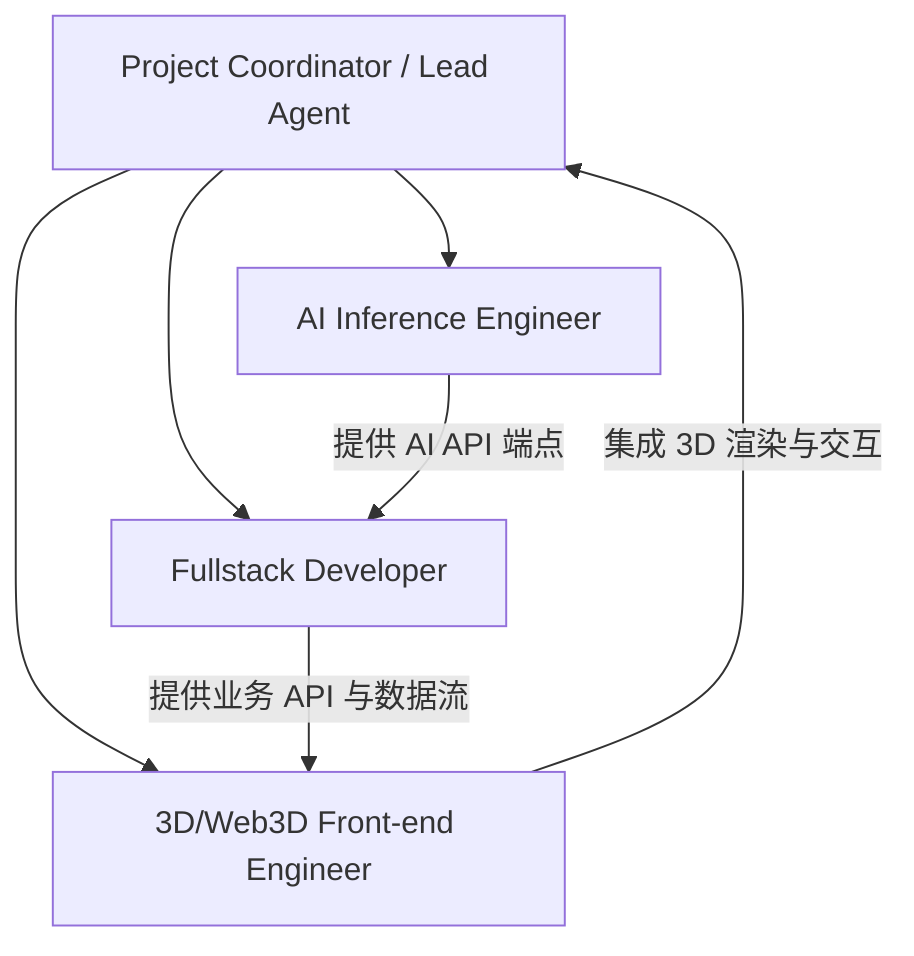

# Image2World 项目商业化规划与技术路线图 (Roadmap)

本项目致力于将单张图片转化为交互式 3D 空间与物体的管线（参考 `image-blaster`），并通过**开源模型自部署**替代昂贵的商业 API（如 Fal.ai、World Labs、ElevenLabs），最终实现低成本、高毛利的商业化盈利。

---

## 1. 商业化盈利模式与核心壁垒

1. **SaaS 订阅与算力点数 (Credits)**：
   - 基础版 / 专业版 / 团队版订阅，每月赠送固定算力点数。
   - 超额点数加油包。
2. **创作者与开发者 API 服务**：
   - 提供标准 RESTful API / Webhook，让游戏开发者、独立站电商、建筑设计师能批量将 2D 资产转化为 3D Splat/GLB 场景。
3. **私有化部署 (Enterprise Edition)**：
   - 针对有高安全性需求的企业（如设计院、保密游戏工作室），提供整套自部署方案。
4. **核心壁垒**：
   - **全自动管线**：一键生成「背景 Splat + 前景物理物体 + 空间音效 + 碰撞网格」的完整世界。
   - **极致的渲染体验**：基于 WebGL/WebGPU 的超顺滑高斯溅射和物理碰撞体验。
   - **极低的推理成本**：通过自部署开源模型和动态 GPU 调度，将单次生成成本降至商业 API 的 10% 以下。

---

## 2. 核心技术栈演进（从 API 到开源自部署）

| 模块 | 原版 `image-blaster` 方案 | 本地开源自部署方案 (推荐) | 开源方案优势与部署要求 |
| :--- | :--- | :--- | :--- |
| **世界高斯溅射** | World Labs `marble-1.1` (高昂) | **TripoSplat** 或 **LGM** (Large Multi-View Gaussian Model) | **LGM / TripoSplat** 支持单图直接生成 3D 高斯溅射 (`.ply` / `.splat` / `.spz`)。 部署：PyTorch + CUDA，推荐 16GB+ VRAM GPU (如 RTX 3090/4090)。 |
| **3D 物体生成** | Hunyuan3D-v3 / Meshy (Fal.ai) | **Hunyuan3D-2.1** (Tencent) | 腾讯最新开源的 Hunyuan3D-2.1 效果极佳，包含几何生成 (DiT) 和 PBR 材质合成 (Paint)。 部署：VRAM 24GB，支持 Apache 2.0 商业许可。 |
| **物体分割与清理** | `nano-banana` / `gpt-image-2` | **SAM 2** (Segment Anything 2) + **LaMa** (Inpainting) 或 **FLUX.1 Fill** | **SAM 2** 负责超精确的物体轮廓分割，**LaMa / FLUX Fill** 负责擦除物体生成干净背景（Clean Plate）。 部署：LaMa 非常轻量，CPU 即可运行；SAM 2 与 FLUX 需要 GPU。 |
| **音效与环境音** | ElevenLabs SFX (按字数收费极贵) | **Stable Audio Open 1.0** 或 Meta **AudioGen (AudioCraft)** | Stable Audio Open 适合生成长达 47 秒的氛围音和 Foley 音效，AudioGen 适合生成短的物体撞击/交互音效。 部署：PyTorch，单张卡即可轻松运行。 |
| **Web 渲染端** | React + Three.js + Radix UI | **Next.js + Three.js / R3F + Tailwind CSS** | 引入 Next.js 方便做 SSR、SEO、用户登录态校验和商业支付路由。 |
| **后端与队列** | 无后端 (磁盘优先 CLI) | **FastAPI (Python) + Celery / Redis 队列** | 商业化必须引入后端处理高并发的 GPU 推理任务排队，并在生成完毕后通过 Webhook 推送给前端。 |
| **存储介质** | 本地 `worlds/` 目录 | **Cloudflare R2** / AWS S3 + 数据库 (PostgreSQL) | R2 零流出流量费 (No Egress Fees)，极度适合分发大体积的高斯溅射 `.spz` 和 GLB 模型。 |

---

## 3. Agent Team 协作开发规划

为了提高开发效率，我们将基于 `/teamwork-preview` 和 Subagent 系统，构建一个由 4 个专业 Agent 组成的开发团队：

### 1) Lead Agent (项目主协调)
- **职责**：任务分发，进度跟进，把控接口规范与系统集成。
- **目标**：保证生成管线与 Web 应用在每一步都完美对接，避免接口冲突。

### 2) AI Inference Engineer (算法部署 Agent)
- **职责**：负责在 GPU 环境（如 Linux/AutoDL/RunPod）上部署 SAM 2, LaMa, Hunyuan3D-2.1, LGM 和 Stable Audio Open。
- **任务**：编写 Python FastAPI 封装的微服务接口，将模型封装为统一的 API，接收图片并返回生成的 3D 网格/溅射/音频，保证推理速度与并发控制。

### 3) Fullstack Developer (全栈业务 Agent)
- **职责**：构建 Next.js 商业化应用后端，设计数据库模型。
- **任务**：集成 Clerk/NextAuth 登录、Stripe/微信/支付宝支付、算力消费点数扣减、Cloudflare R2 资产上传、异步推理任务队列管理（Redis/Celery）。

### 4) 3D/Web3D Front-end Engineer (前端 3D 交互 Agent)
- **职责**：重构并优化 React Three Fiber 3D 场景渲染和摆放编辑器。
- **任务**：实现顺畅的 SPZ Splat 渲染，整合 Rapier 物理引擎，优化第一人称操控、空间 3D 音频播放，以及精美的 SaaS UI 界面。

---

## 4. 落地实施步骤 (Step-by-Step Implementation)

### 阶段一：原型迁移与架构搭建 (Weeks 1-2)
- [x] **初始化项目**：在 `image2world` 中搭建 Next.js 15 + Tailwind CSS 的基本架构。
- [x] **迁移 viewer 代码**：将 `image-blaster/app` 中成熟的 Three.js / R3F 渲染和摆放编辑器（PlacementEditor）代码移植进来，使用本地 JSON 加载模式。
- [x] **接口对接设计**：开发了 Next.js 服务器 API 接口，实现 `/api/worlds` 扫描与 `/api/scene-project` 读写，打通了前后端对接。

### 阶段二：本地开源 AI 推理节点部署 (Weeks 3-4)
- [x] **初始化 AI 推理微服务框架**：搭建了 Python FastAPI + Uvicorn 架构的 `backend/server.py`，设计了延迟加载与 VRAM 清理机制以适配 5060 Ti 16GB 显存。
- [x] **并发保护**：所有重端点改为经 `asyncio.to_thread` + `Semaphore(1)` 调度——推理不再阻塞事件循环（健康检查 9.04 s → 0.21 s，此前会导致前端 3 秒超时误报「后端离线」），并发请求排队而非争抢显存（实测 3 并发完美串行）。详见 PROJECT_REPORT §3.12。
- [x] **图像预处理与 Clean Plate**：已实现 `/api/segment`（SAM 2 自动掩码 + base64 PNG 序列化）、`/api/crop`（Pillow 透明裁剪）与 `/api/inpaint`（Simple-LaMa 单次擦除所有掩码并集），完成自动抠图与背景擦除。
- [x] **3D 物体生成（TripoSR 优化）**：已部署 `/api/image-to-3d`（TripoSR + 背景去除/前景缩放），输出 GLB 网格；E2E 世界已验证生成真实模型。
- [x] **SFX 发生微服务**：已部署 `/api/generate-sfx` 碰撞/Foley 音效接口（当前采用 **AudioLDM-S**，非 Stable Audio Open；模型可后续替换）。
- [x] **测试与联调**：`backend/test_client.py` / `test_pipeline.js` 已就绪；2026-06-13 完成冒烟验证——后端健康检查 + CUDA + SAM2 实时分割（home 图检出 13 物体），前端全部路由 200、生成世界渲染、GLB 资产正常服务。

- [x] **SAM 3 概念分割（可切换）**：在保留 SAM 2 路径基础上，新增 SAM 3 概念/文本提示分割后端，输出**语义标签**并贯通到物体命名与 SFX 提示词；通过 `IMAGEWORLD_SEGMENTER=sam3` 开关启用，未安装时自动降级 SAM 2（详见 PROJECT_REPORT §3.6）。

- [x] **真实单图背景重建**：clean plate 已接入 Apple SHARP `/api/image-to-splat`，为每个世界生成独立 `.ply` 高斯溅射；仅在 SHARP 不可用时降级到 `home-room` 静态背景。

#### ⚠️ 2026-08-01 方向调整：放弃前景物体实例，管线收敛为纯场景重建

上述 SAM / TripoSR / AudioLDM / LaMa 前景链路**已从生成管线中移除**（后端端点保留，延迟加载不占显存）。理由：TripoSR 从单图猜测的几何与原物差距过大，且 SAM 自动分割选中的「最大 5 个区域」多为墙面、地板与门窗，而非可交互道具。

更重要的是，擦除前景对**场景本身**是净损失——它把照片里真实的家具几何抹掉，再用猜测填回。现在源图原样送入 SHARP，家具作为真实几何被重建进世界。

产品定位随之明确：**核心是一个可漫游的三维情景，而非情景里可以踢动的家具**。

效果：端到端耗时 数分钟 → **43 秒**，参与推理的模型仅剩 SHARP。详见 PROJECT_REPORT §3.7。

- [x] **本地开发工具部署门禁**：`/api/open-world-folder` 与 `/api/open-claude-terminal` 会在服务端机器上启动进程，生产环境默认返回 404（可用 `NEXT_PUBLIC_IMAGEWORLD_LOCAL_TOOLS=true` 显式开启）。因 BYOK 使项目变得可部署，该风险由理论转为现实。详见 PROJECT_REPORT §3.13。

### 阶段三：全栈 SaaS 系统开发 (Weeks 5-6)
- [ ] **用户与权限**：集成 Clerk 登录，开发管理控制台。
- [ ] **点数与计费**：设计点数消费表，集成 Stripe/Paypal，支持包月订阅和充值。
- [ ] **存储与分发**：配置 Cloudflare R2，实现 AI 生成文件自动上传并返回 CDN 加速链接。
- [ ] **推理队列系统**：实现后端收到生成请求 -> 插入 Redis 队列 -> AI 推理 worker 消费 -> 任务状态更新并写入 R2 和数据库 -> 实时 Webhook/SSE 通知前端。

### 阶段四：管线打通与精细化打磨 (Weeks 7-8)
- [x] **前后端全流程联调**：用户上传图片 -> SHARP 重建场景 Splat -> 提取碰撞体与地面标定 -> 加载进 3D Viewer -> 自由漫游和编辑。
- [ ] **加载与性能优化**：把 `.ply` 转为 **SPZ**（Spark 原生支持，体积约降一个数量级），首屏加载实现渐进式显示。当前单个世界 105 MB，其中 full_res PLY 占 64 MB。
- [ ] **碰撞与漫游手感**：改善 collider 质量（补洞、去噪），优化行走碰撞响应与相机手感。
  - [x] **出生点落在房间内**：此前硬编码 `z=-0.5`，实测位于房间几何之外 2.1 m（拍照者本就站在被拍空间外，故原点天然在几何外）。现由 collider 包围盒推算并写入 `scene.json` 的 `spawnPoint`，旧世界回退兼容。详见 PROJECT_REPORT §3.8。
  - [~] **场景边界**：已实现后又回滚（commit `98737e5` → `d61bce3`）。实测从出生点扫描 24 个方向，**8 个完全没有身体高度的几何**，且全部集中在相机背后 135°–210°——单视角拍不到自己背后，碰撞体因此不闭合（`is_watertight=False`）。人工围栏能解决，但世界模型生成 360° 场景后碰撞体会自然闭合，围栏即成冗余，故不为过渡期保留该机制。
- [x] **验证世界模型可行性（Marble 实测通过）**：2026-08-02 用 Marble API 生成一次，**封闭性 0/24 敞开**（SHARP 为 8/24）、地面面积 211 m²（SHARP 68 m²）、输出格式与本项目**原生兼容、前端零改动**。详见 PROJECT_REPORT §3.10。
- [x] **接入世界模型（BYOK）**：生成弹窗新增可选的 Marble API Key 输入框，附 [获取入口](https://platform.worldlabs.ai/api-keys)。**填了走 Marble、没填走本地 SHARP**，两条管线并存。Key 存于浏览器 `localStorage`，随请求传递，服务端不落盘、不入日志、仅置于 `WLT-Api-Key` 请求头。商业上等于**用户自带算力**，产品不承担 API 成本。
- [ ] **世界模型的长期取舍**：SHARP 的两个根本缺陷——走进虚空、遮挡处条纹涂抹——已确认是同一根因。BYOK 已让用户可自行选择；若日后要自己承担生成成本，仍需在下列之间决策：
  - **Marble API**：$1.20/次、约 8 分钟、零运维、格式原生兼容、质量已验证。缺点是依赖外部服务与持续成本
  - **Matrix-3D 自部署**：MIT 许可、本机 16 GB 可跑（5B low-VRAM 约 12 GB），但慢且质量未验证。**注意：云 GPU 跑它约 $1–2/次，并不比 Marble 便宜**——自部署只有在本地 GPU 上才有成本优势
  - **HunyuanWorld-1.0-lite** 需 18 GB 超出本机，且许可排除欧盟/英国/韩国、设 100 万 MAU 上限
- [ ] **SPZ 迁移**：Marble 实测印证 SPZ 单位 splat 体积约为 PLY 的 1/4（13.5 vs 53 bytes）。若改用 Marble，此项自动完成；若继续自部署，则需在管线尾部加转换。
- [ ] **移动端适配**：优化手机端陀螺仪和触控操作，提升分享体验。

#### 2026-07-31 交付加固

- [x] 生产构建移除在线 Google 字体依赖，恢复 Next.js TypeScript 构建校验，Lint 零告警。
- [x] 生成路由增加 10 MB / PNG-JPG-WEBP 服务端校验、可配置后端地址与健康检查。
- [x] 世界生成采用隐藏暂存目录，成功后原子发布，失败时清理残留。
- [x] 创建弹窗增加后端状态、内联错误、键盘关闭、焦点样式与手机端滚动；通过 portal 修复侧栏动画导致的移动端定位偏移。

### 阶段五：上线与商业化推广 (Week 9+)
- [ ] **SEO 优化与落地页**：制作令人惊艳的炫酷 3D 动效落地页，吸引早期流量。
- [ ] **Beta 测试**：放开免费试用限额，收集用户反馈。
- [ ] **商业化正式发布**。
